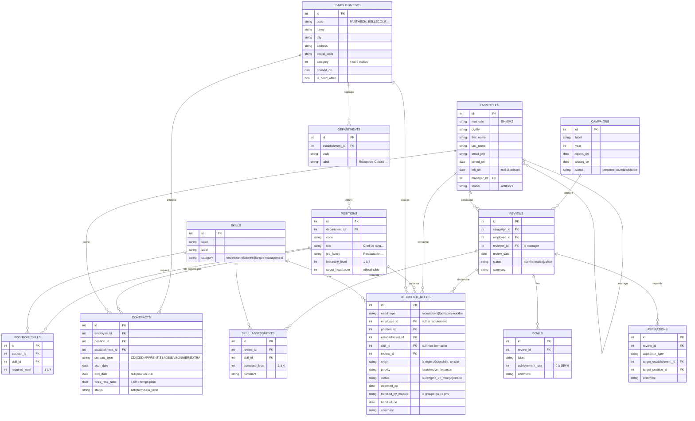

# Le socle SIRH Sorbonne-Hôtel — guide des groupes

*Master 2 SIRH · Université Paris 1 Panthéon-Sorbonne*

Sorbonne-Hôtel est une chaîne hôtelière française de cinq établissements et
cent cinquante salariés. Son SIRH existe déjà pour la partie commune :
le **Core HR** (qui travaille où, à quel poste, sous quel contrat) et
l'**Évaluation** (entretiens annuels, objectifs, compétences, souhaits
d'évolution).

Votre groupe développe **un module** qui se branche dessus.

---

## 1. La règle d'or

> **Le socle RH est en lecture seule.**
> Vous le lisez, et vous créez vos propres données dans votre propre schéma.
>
> Une seule exception : faire passer un **besoin identifié** d'`ouvert` à
> `pris_en_charge`, puis à `cloture` — et uniquement les besoins **du type que
> votre module traite**.

Ce n'est pas une règle de politesse. Le socle est en lecture seule **dans la
base de données** : si votre code essaie d'y écrire, PostgreSQL le refuse.

Les écrans du socle — Besoins, Salariés, Postes, Entretiens — sont des écrans
de **consultation**. Ils n'ont aucun bouton d'action, et c'est voulu : ce sont
vos écrans à vous qui agissent.

### Chacun chez soi

Le menu de gauche montre le SIRH entier : le socle, puis les six modules du
cours. **Un seul est ouvrable, le vôtre.** Les cinq autres sont grisés : ils
appartiennent à d'autres groupes.

La séparation tient à trois niveaux, et aucun n'est décoratif :

| | |
|---|---|
| **L'application** | le menu et le routeur n'ouvrent que votre module |
| **L'API** | votre jeton dit qui vous êtes, et ce que vous avez le droit de faire |
| **PostgreSQL** | vous êtes propriétaire de votre schéma, et de lui seul |

Votre travail tient entièrement dans `app/src/modules/<votre code>/`, sprint
après sprint. Vous ne touchez jamais un fichier partagé.

---

## 2. Le pivot : les besoins identifiés

Tout le dispositif tourne autour d'une table : `identified_needs`.

Une commande, que l'intervenant lance quand il le décide, parcourt les
entretiens et l'état des effectifs, et en déduit des besoins RH. Trois règles,
trois types de besoin :

| Règle | Ce qui la déclenche | Type produit |
|---|---|---|
| **Formation** | Un niveau constaté en entretien inférieur au niveau attendu sur le poste | `formation` |
| **Mobilité** | Un souhait d'évolution exprimé par un salarié dont les objectifs sont tenus (≥ 70 % d'atteinte) | `mobilite` |
| **Recrutement** | Un poste dont l'effectif réel est sous l'effectif cible, ou un contrat se terminant sous 90 jours sans relève | `recrutement` |

Un besoin de recrutement n'est rattaché à **personne** : `employee_id` y est
vide. C'est normal — on recrute pour un poste, pas pour quelqu'un.

### Qui prend en charge quoi

**Tout le monde lit tous les besoins** — c'est ce qui permet de voir la chaîne
entière en démonstration. Mais chaque module n'en **prend en charge** qu'un
seul type :

| Module | Prend en charge |
|---|---|
| Module Recrutement | les besoins de type `recrutement` |
| Module Formation | les besoins de type `formation` |
| Module Mobilité & carrière | les besoins de type `mobilite` |
| Module Gestion des temps | *aucun* |
| Module Portail RH & Self-Service | *aucun* |
| Module Onboarding & Offboarding | *aucun* |

L'API refuse le reste, avec un message qui le dit. Les trois modules du bas ne
consomment pas de besoins : ils travaillent directement sur les salariés, les
contrats et l'organisation.

---

## 3. Le vocabulaire

Le code est en anglais, les libellés affichés en français. Voici la
correspondance, à garder sous les yeux :

| En base | C'est-à-dire |
|---|---|
| `establishments` | les hôtels |
| `departments` | les départements (Réception, Cuisine…), propres à un hôtel |
| `positions` | les postes, avec leur **effectif cible** |
| `position_skills` | les compétences attendues sur un poste, niveau 1 à 4 |
| `skills` | le référentiel de compétences |
| `employees` | les salariés, avec leur manager |
| `contracts` | les contrats — leur suite forme le parcours d'un salarié |
| `campaigns` | les campagnes d'entretiens annuels |
| `reviews` | les entretiens annuels |
| `goals` | les objectifs fixés en entretien, et leur taux d'atteinte |
| `skill_assessments` | les niveaux constatés en entretien |
| `aspirations` | les souhaits d'évolution exprimés |
| `identified_needs` | **les besoins identifiés — le pivot** |

---

## 4. Le modèle de données



---

## 5. Démarrer en cinq minutes

**Vous ne lancez jamais de base de données ni de serveur.** L'API du cours
tourne déjà, en ligne, et tous les groupes tapent dessus. Vous ne faites tourner
que l'interface.

Ouvrez le projet dans StackBlitz, puis, dans le terminal :

```bash
npm install
npm run dev
```

Ces deux commandes fonctionnent depuis la racine du projet comme depuis le
dossier `app/`.

> Vous ne verrez jamais de commande `docker` dans ce guide : StackBlitz n'a ni
> Docker ni noyau Linux, et vous n'en avez pas besoin. L'API est déjà en ligne.

**Créez ensuite votre fichier de configuration.** Il vit dans le dossier
`app/`, à côté de `package.json` : copiez-y `.env.example` en `.env` et
remplissez les deux lignes avec ce que l'intervenant vous a remis :

```
VITE_API_TOKEN=le-jeton-de-votre-groupe
VITE_MODULE_CODE=rec
```

Puis **relancez `npm run dev`** : une variable d'environnement n'est lue qu'au
démarrage. Tant que ce fichier manque, l'application affiche un écran qui vous
le rappelle.

L'application s'ouvre sur l'**accueil du logiciel** : l'entreprise en cinq
chiffres, la chaîne qui va de l'entretien annuel au module qui agit, et les six
modules du cours.

Le menu de gauche montre ensuite le socle — Besoins, Salariés, Postes,
Entretiens, Console SQL — puis les six modules. Le vôtre porte l'étiquette
« votre groupe » ; les cinq autres sont grisés et fermés.

Votre module a déjà une page : **Accueil du module**. Le socle la fournit et
l'entretient, elle marche avant que vous ayez écrit quoi que ce soit. C'est
votre tableau de bord de sprint : combien de besoins vous attendent, quelles
tables vous avez créées et combien de lignes elles contiennent, quels écrans
existent. **Toutes les autres pages sont les vôtres.**

**Avant d'écrire quoi que ce soit, parcourez le socle.** Les salariés, les
postes, les entretiens, les besoins identifiés. Vous y verrez ce dont la
chaîne a besoin, et donc ce que votre module doit savoir faire. C'est le
travail du premier sprint, et il ne se fait pas dans un éditeur.

Quand vous saurez ce que vous construisez, créez votre manifeste. C'est le
seul fichier dont la forme est imposée :

```js
// app/src/modules/rec/module.js      ← rec = le code de VOTRE groupe
export default {
  code: 'rec',
  routes: [
    { path: 'mon-ecran', label: 'Mon écran',
      component: () => import('./MonEcran.vue') },
  ],
}
```

Créez le fichier `.vue` correspondant, et l'écran apparaît dans le menu, sous
votre page d'accueil. Le nom et l'icône de votre module sont fixés par le
socle : votre manifeste ne décrit que vos écrans.

---

## 6. Deux façons d'accéder aux données

C'est la distinction la plus importante du cours, et elle est volontaire :

| | Le socle | Vos données |
|---|---|---|
| **Quoi** | établissements, salariés, entretiens, besoins | vos offres, vos sessions, vos absences… |
| **Comment** | `getSalaries()`, `getBesoins()`… | `sql()`, `insert()`, `update()` |
| **Droits** | lecture seule | tous les droits, chez vous |
| **Pourquoi** | c'est un produit qu'on consomme par son API | c'est votre schéma, vous le modélisez |

Vous pouvez **joindre les deux** en SQL, et c'est là que ça devient
intéressant :

```sql
select c.nom, c.statut, n.priority, p.title, e.name
from   candidatures c
join   public.identified_needs n on n.id = c.besoin_id
join   public.positions        p on p.id = n.position_id
join   public.establishments   e on e.id = n.establishment_id
where  n.need_type = 'recrutement' and n.status = 'ouvert';
```

---

## 7. Le SDK

Tout s'importe depuis `@/socle/sdk`. Si une fonction n'y est pas, elle
n'existe pas pour vous.

```js
import { getBesoins, getSalaries, sql, insert, formatDate, toast } from '@/socle/sdk'
```

### Lire le socle

```js
await getEtablissements()
await getDepartements({ etablissementId: 1 })
await getPostes({ vacants: true, etablissementId: 3 })
await getPoste(12)                                   // + compétences attendues
await getCompetences({ categorie: 'langue' })

await getSalaries({ etablissementId: 1, q: 'martin' })
await getSalarie(45)                                 // + parcours contractuel
await getContrats({ finAvant: '2026-12-31' })

await getCampagnes()
await getEntretiens({ statut: 'valide', etablissementId: 2 })
await getEntretien(3)                                // + objectifs, écarts, souhaits
await getAspirations({ typeAspiration: 'changement_poste' })

await getBesoins({ typeBesoin: 'formation', statut: 'ouvert' })
await getBesoin(37)

await getReferentiels()                              // toutes les listes de valeurs
```

Tous les filtres sont **facultatifs et se combinent**. Aucune pagination :
les listes sont renvoyées entières.

### Faire avancer un besoin — la seule écriture autorisée

Ces trois fonctions ne s'appellent que **depuis vos propres écrans**. Les
écrans du socle n'en ont aucun bouton : c'est votre module qui agit.

```js
await prendreEnChargeBesoin(37, 'Offre en cours de rédaction')
await cloturerBesoin(37, 'Poste pourvu le 12/11')
await relacherBesoin(37)     // pris par erreur : il redevient disponible
```

Trois refus possibles, et leurs messages sont explicites :

- le besoin n'est pas du type que votre module traite ;
- votre module ne consomme aucun besoin (Gestion des temps, Portail RH,
  Onboarding) ;
- un autre groupe l'a déjà pris.

Votre module est déduit de votre jeton : il n'y a rien à passer, et personne ne
peut agir au nom d'un autre groupe.

Un enchaînement typique, dans un écran de votre module :

```js
async function traiter(besoin) {
  try {
    await prendreEnChargeBesoin(besoin.id, 'Offre en préparation')
    const offre = await insert('offres', {
      besoin_id: besoin.id,
      intitule: `${besoin.position_title} — ${besoin.establishment_name}`,
    })
    toast.succes(`Offre ${offre.id} créée`)
    await besoins.refresh()
  } catch (erreur) {
    toast.erreur(erreur.message)
  }
}
```

### Vos propres tables

```js
// lecture
const offres = await sql('select * from offres order by id desc')
const trouves = await sql(
  'select * from candidats where nom ilike :motif',
  { motif: `%${recherche.value}%` },
)

// écriture
await insert('candidats', { nom: 'Meyer', prenom: 'Léa', source: 'spontanée' })
await update('candidatures', 12, { statut: 'entretien' })
await remove('offres', 3)

// version réactive, pour un écran
const offres = useQuery('select * from offres order by id desc')
// offres.rows · offres.loading · offres.error · offres.refresh()
```

> ⚠️ **Ne jamais coller une valeur dans une requête.** Les paramètres `:nom`
> sont là pour ça, et ils gèrent les apostrophes, les accents et les pourcents
> tout seuls.
>
> ```js
> ✅ sql('select * from offres where statut = :s', { s: statut.value })
> ❌ sql(`select * from offres where statut = '${statut.value}'`)
> ```

### Mise en forme

```js
formatDate('2026-03-14')           // '14/03/2026'
formatDate('2026-03-14', 'long')   // '14 mars 2026'
anciennete(79)                     // '6 ans et 7 mois'
formatNombre(1234.5, 1)            // '1 234,5'
toast.succes('Offre créée')
toast.erreur('Impossible de charger les candidats')
```

---

## 8. Les endpoints, avec une réponse réelle

Base : l'URL de l'API que l'intervenant vous a donnée.
En-tête obligatoire : `Authorization: Bearer <votre jeton>`.

Les exemples ci-dessous sont de **vraies réponses** du socle.

### Établissements

`GET /etablissements`

```json
{
  "id": 2,
  "code": "BELLECOUR",
  "name": "Sorbonne-Hôtel Bellecour",
  "city": "Lyon",
  "postal_code": "69002",
  "address": "8 place Bellecour",
  "category": 4,
  "opened_on": "1998-09-01",
  "is_head_office": false,
  "headcount": 28
}
```

### Départements

`GET /departements?etablissement_id=1`

```json
{
  "id": 7,
  "code": "COM",
  "label": "Commercial",
  "establishment_id": 1,
  "establishment_name": "Sorbonne-Hôtel Panthéon",
  "establishment_city": "Paris",
  "headcount": 2
}
```

### Postes

`GET /postes?vacants=true`

```json
{
  "id": 30,
  "code": "BAGAGISTE",
  "title": "Bagagiste",
  "job_family": "Hébergement",
  "hierarchy_level": 1,
  "target_headcount": 1,
  "current_headcount": 0,
  "vacancies": 1,
  "department_id": 10,
  "department_label": "Réception",
  "establishment_id": 2,
  "establishment_name": "Sorbonne-Hôtel Bellecour",
  "establishment_city": "Lyon"
}
```

### Un poste

`GET /postes/1`

```json
{
  "id": 1,
  "code": "RECEPTIONNISTE",
  "title": "Réceptionniste",
  "job_family": "Hébergement",
  "hierarchy_level": 1,
  "target_headcount": 5,
  "current_headcount": 5,
  "vacancies": 0,
  "department_id": 1,
  "department_label": "Réception",
  "establishment_id": 1,
  "establishment_name": "Sorbonne-Hôtel Panthéon",
  "establishment_city": "Paris",
  "required_skills": [
    {
      "skill_id": 23,
      "skill_code": "EN",
      "skill_label": "Anglais professionnel",
      "category": "langue",
      "category_label": "Langue",
      "required_level": 3
    },
    {
      "skill_id": 24,
      "skill_code": "ES",
      "skill_label": "Espagnol professionnel",
      "category": "langue",
      "category_label": "Langue",
      "required_level": 2
    }
  ]
}
```

### Salariés

`GET /salaries?departement_id=1`

```json
{
  "id": 9,
  "matricule": "SH-0009",
  "civility": "MME",
  "first_name": "Louise",
  "last_name": "Brun",
  "full_name": "Louise Brun",
  "email_pro": "louise.brun@sorbonne-hotel.fr",
  "joined_on": "2009-07-16",
  "left_on": null,
  "seniority_months": 205,
  "status": "actif",
  "status_label": "Présent",
  "manager_id": 6,
  "manager_name": "Thomas Caron",
  "contract_id": 11,
  "contract_type": "CDI",
  "contract_type_label": "CDI",
  "contract_start_date": "2009-07-16",
  "contract_end_date": null,
  "work_time_ratio": 1.0,
  "position_id": 5,
  "position_title": "Voiturier",
  "job_family": "Hébergement",
  "hierarchy_level": 1,
  "department_id": 1,
  "department_label": "Réception",
  "establishment_id": 1,
  "establishment_name": "Sorbonne-Hôtel Panthéon",
  "establishment_city": "Paris"
}
```

### Contrats

`GET /contrats?fin_avant=2026-12-15`

```json
{
  "id": 74,
  "employee_id": 69,
  "employee_name": "Hélène Dupont",
  "matricule": "SH-0069",
  "contract_type": "CDD",
  "contract_type_label": "CDD",
  "start_date": "2026-03-17",
  "end_date": "2026-12-12",
  "work_time_ratio": 1.0,
  "status": "actif",
  "status_label": "En cours",
  "days_to_end": 88,
  "position_id": 48,
  "position_title": "Réceptionniste",
  "department_id": 17,
  "department_label": "Réception",
  "establishment_id": 3,
  "establishment_name": "Sorbonne-Hôtel Garonne"
}
```

### Compétences

`GET /competences?categorie=langue`

```json
{
  "id": 23,
  "code": "EN",
  "label": "Anglais professionnel",
  "category": "langue",
  "category_label": "Langue"
}
```

### Campagnes

`GET /campagnes`

```json
{
  "id": 1,
  "label": "Entretiens annuels 2026",
  "year": 2026,
  "opens_on": "2026-07-17",
  "closes_on": "2026-10-15",
  "status": "ouverte",
  "status_label": "Ouverte",
  "reviews_count": 119
}
```

### Entretiens

`GET /entretiens?statut=valide`

```json
{
  "id": 2,
  "campaign_id": 1,
  "campaign_label": "Entretiens annuels 2026",
  "employee_id": 2,
  "employee_name": "Théo Roux",
  "matricule": "SH-0002",
  "position_title": "Réceptionniste",
  "establishment_id": 1,
  "establishment_name": "Sorbonne-Hôtel Panthéon",
  "reviewer_id": 6,
  "reviewer_name": "Thomas Caron",
  "review_date": "2026-09-09",
  "status": "valide",
  "status_label": "Validé",
  "summary": "Quelques difficultés en période de forte affluence, accompagnement à prévoir.",
  "goals_count": 3,
  "average_achievement_rate": 77,
  "skill_gaps_count": 0,
  "aspirations_count": 1
}
```

### Un entretien

`GET /entretiens/3`

```json
{
  "id": 3,
  "campaign_id": 1,
  "campaign_label": "Entretiens annuels 2026",
  "employee_id": 3,
  "employee_name": "Sandrine Perez",
  "matricule": "SH-0003",
  "position_title": "Réceptionniste",
  "establishment_id": 1,
  "establishment_name": "Sorbonne-Hôtel Panthéon",
  "reviewer_id": 6,
  "reviewer_name": "Thomas Caron",
  "review_date": "2026-07-30",
  "status": "valide",
  "status_label": "Validé",
  "summary": "Quelques difficultés en période de forte affluence, accompagnement à prévoir.",
  "goals_count": 3,
  "average_achievement_rate": 83,
  "skill_gaps_count": 2,
  "aspirations_count": 0,
  "goals": [
    {
      "id": 6,
      "review_id": 3,
      "label": "Porter la note d'accueil à 4,5/5 sur les avis en ligne",
      "achievement_rate": 70,
      "comment": null
    }
  ],
  "skill_assessments": [
    {
      "id": 14,
      "review_id": 3,
      "skill_id": 23,
      "skill_code": "EN",
      "skill_label": "Anglais professionnel",
      "category": "langue",
      "assessed_level": 2,
      "required_level": 3,
      "gap": 1,
      "comment": null
    },
    {
      "id": 15,
      "review_id": 3,
      "skill_id": 24,
      "skill_code": "ES",
      "skill_label": "Espagnol professionnel",
      "category": "langue",
      "assessed_level": 2,
      "required_level": 2,
      "gap": 0,
      "comment": null
    }
  ],
  "aspirations": []
}
```

### Aspirations

`GET /aspirations`

```json
{
  "id": 1,
  "review_id": 2,
  "employee_id": 2,
  "employee_name": "Théo Roux",
  "aspiration_type": "changement_poste",
  "aspiration_type_label": "Changement de poste",
  "target_establishment_id": null,
  "target_establishment_name": null,
  "target_position_id": 7,
  "target_position_title": "Gouvernante d'étage",
  "comment": null
}
```

### Besoins

`GET /besoins?type_besoin=recrutement&statut=ouvert`

```json
{
  "id": 174,
  "need_type": "recrutement",
  "need_type_label": "Recrutement",
  "priority": "haute",
  "priority_label": "Haute",
  "status": "ouvert",
  "status_label": "Ouvert",
  "origin": "3 contrat(s) se terminant avant le 2026-09-29 sans remplacement prévu",
  "detected_on": "2026-09-15",
  "employee_id": null,
  "employee_name": null,
  "matricule": null,
  "position_id": 96,
  "position_title": "Femme / valet de chambre",
  "job_family": "Hébergement",
  "hierarchy_level": 1,
  "department_id": 32,
  "department_label": "Hébergement",
  "establishment_id": 5,
  "establishment_name": "Sorbonne-Hôtel Mont-Blanc",
  "establishment_city": "Annecy",
  "skill_id": null,
  "skill_code": null,
  "skill_label": null,
  "review_id": null,
  "handled_by_module": null,
  "handled_on": null,
  "comment": null
}
```

### Référentiels

`GET /referentiels`

```json
{
  "type_besoin": [
    {
      "code": "recrutement",
      "label": "Recrutement"
    },
    {
      "code": "formation",
      "label": "Formation"
    },
    {
      "code": "mobilite",
      "label": "Mobilité"
    }
  ],
  "type_contrat": [
    {
      "code": "CDI",
      "label": "CDI"
    },
    {
      "code": "CDD",
      "label": "CDD"
    },
    {
      "code": "APPRENTISSAGE",
      "label": "Contrat d'apprentissage"
    },
    {
      "code": "SAISONNIER",
      "label": "Contrat saisonnier"
    },
    {
      "code": "EXTRA",
      "label": "Extra"
    }
  ]
}
```

---

## 9. Vos propres tables

Votre groupe est **propriétaire d'un schéma PostgreSQL** qui porte son code.
Vous y créez ce que vous voulez. Vous lisez le socle et les schémas des cinq
autres groupes. Vous ne pouvez rien écrire ailleurs que chez vous — et ce
n'est pas une convention, c'est la base qui l'applique.

### La console SQL

Le socle a un écran **Console SQL**. Vous y mettez au point vos instructions,
vous voyez les erreurs de PostgreSQL telles quelles, et vous recopiez ce qui
marche dans `src/modules/<votre code>/schema.sql`.

Ce fichier est un livrable : il permet de rejouer votre modèle de données à
l'identique si quelque chose est cassé.

### Les cinq règles à respecter

1. **Pas de préfixe.** Votre schéma vous isole déjà : `candidats`, pas
   `rec_candidats`.
2. **Une colonne `id serial primary key`** dans chaque table. Les helpers
   `update()` et `remove()` en dépendent.
3. **Des clés étrangères entre VOS tables** : `candidature.candidat_id
   references candidats(id)`. C'est ce qui empêche les données incohérentes.
4. **Jamais de clé étrangère vers le socle.** Un `besoin_id` est un `integer`,
   pas une `references public.identified_needs(id)`. Sinon la remise à zéro du
   socle emporterait vos données. Les identifiants du socle sont stables :
   ils ne changent pas d'une remise à zéro à l'autre.
5. **`create table if not exists`**, pour que votre `schema.sql` soit rejouable.

### La forme, pas le contenu

Ce squelette montre les cinq règles à l'œuvre. À vous de décider ce que vos
tables contiennent — c'est le cœur de votre sprint de conception.

```sql
-- Une table principale.
create table if not exists ma_table (
  id         serial primary key,
  besoin_id  integer,                    -- référence LOGIQUE au socle
  libelle    text    not null,
  statut     text    not null default 'brouillon',
  creee_le   date    not null default current_date
);

-- Une table qui dépend de la première : clé étrangère, chez vous, autorisée.
create table if not exists ma_table_detail (
  id          serial primary key,
  ma_table_id integer not null references ma_table(id) on delete cascade,
  libelle     text    not null
);
```

---

## 10. Le kit de prompts

Ces prompts sont faits pour être collés tels quels dans Copilot. Le principe
est toujours le même : **on donne du contexte réel, on demande un fichier
complet, on interdit les explications.**

### Prompt 1 — le contexte, à donner une fois par conversation

```
Je développe un module dans une application Vue 3 + PrimeVue.
Voici le contrat de l'API que je consomme :

[coller le contenu de app/contrat-api.md — il est dans votre projet]

Voici un écran existant du projet, qui me sert de modèle :

[coller le contenu de app/src/corehr/BesoinsList.vue]

Réponds toujours par un fichier .vue complet, sans explication et sans
commentaire d'introduction.
```

### Prompt 2 — un écran de liste

```
Écris-moi l'écran qui affiche la liste des besoins de formation ouverts,
filtrable par établissement et par priorité. Il doit afficher le salarié
concerné, la compétence, le niveau attendu et le niveau constaté.
Rends uniquement le fichier complet, sans explication.
```

### Prompt 3 — un écran sur mes propres données

```
Mon groupe possède le schéma PostgreSQL « rec » et ces tables :

[coller le contenu de votre schema.sql]

J'y accède avec ces fonctions, importées de '@/socle/sdk' :
  sql(requete, params)          exécute une requête, renvoie les lignes
  insert(table, objet)          insère et renvoie la ligne créée
  update(table, id, objet)      modifie et renvoie la ligne
  remove(table, id)             supprime
  useQuery(requete, params)     version réactive : .rows .loading .error .refresh()
Les paramètres s'écrivent :nom et se passent dans un objet.

Écris-moi l'écran qui liste les offres avec le nombre de candidatures reçues,
et un bouton pour créer une offre dans une boîte de dialogue.
Rends uniquement le fichier complet, sans explication.
```

### Prompt 4 — modéliser ses tables

```
Mon module gère [décrire le périmètre en deux phrases].
Il doit pouvoir répondre à ces questions : [lister 4 ou 5 questions métier].

Écris-moi le SQL de création des tables, pour PostgreSQL. Contraintes :
- chaque table a une colonne « id serial primary key »
- des clés étrangères entre mes tables
- aucune clé étrangère vers d'autres schémas : une référence au socle est
  une simple colonne integer
- « create table if not exists » partout
Rends uniquement le SQL, sans explication.
```

### Prompt 5 — corriger une erreur

```
Cet écran remonte cette erreur :

[coller le message exact, sans le reformuler]

Voici le fichier complet :

[coller le fichier]

Corrige-le. Rends uniquement le fichier complet corrigé.
```

### Ce qui fait la différence

- **Coller le contrat d'API au début de chaque nouvelle conversation.** Une IA
  qui ne l'a pas invente des endpoints qui n'existent pas.
- **Coller un écran existant comme modèle.** C'est ce qui fait que le code
  rendu ressemble au reste du projet et fonctionne du premier coup.
- **Demander un fichier complet.** Un extrait à recoller au bon endroit est la
  première source d'erreurs quand on ne lit pas le code.
- **Coller les messages d'erreur tels quels.** Ils viennent de PostgreSQL ou de
  l'API et sont précis ; les reformuler en perd le sens.

---

## 11. Les six modules

Chaque groupe travaille dans `src/modules/<code>/` et possède le schéma
PostgreSQL du même nom. Il n'ouvre que son module ; les cinq autres sont
fermés.

### `rec` — Module Recrutement

Offres, candidats, candidatures, processus de recrutement.

- `getBesoins({ typeBesoin: 'recrutement', statut: 'ouvert' })` — vos entrées.
  `origin` dit pourquoi le besoin existe : sous-effectif ou départ à venir.
- `getPostes({ vacants: true })` — les postes à pourvoir, avec effectif cible
  et effectif réel.
- `getContrats({ finAvant: '…' })` — les échéances, donc les remplacements à
  anticiper.
- `getPoste(id)` — les compétences attendues, pour rédiger l'offre.
- Vous clôturez un besoin quand le poste est pourvu.

### `form` — Module Formation

Catalogue, sessions, inscriptions, suivi.

- `getBesoins({ typeBesoin: 'formation' })` — un besoin = un salarié + une
  compétence. `skill_id` et `skill_label` sont renseignés.
- `getCompetences()` — le référentiel, pour bâtir le catalogue.
- `getEntretien(id)` — le détail des écarts : niveau attendu, niveau constaté.
- `getSalaries()` — les inscrits.
- Vous clôturez un besoin quand le salarié a suivi la session.

### `mob` — Module Mobilité & carrière

Opportunités, souhaits d'évolution, mobilités internes, parcours.

- `getBesoins({ typeBesoin: 'mobilite' })` — vos entrées.
- `getAspirations()` — ce que les salariés ont exprimé, avec l'établissement
  ou le poste visé quand ils l'ont précisé.
- `getPostes()` — les opportunités, avec leur niveau hiérarchique.
- `getSalarie(id)` — le parcours contractuel, base d'un plan de carrière.

### `gta` — Module Gestion des temps

Pointages, congés, absences, compteurs, planning.

Ce module **ne consomme aucun besoin identifié** : il travaille directement
sur les salariés et leurs contrats.

- `getSalaries({ etablissementId })` — l'effectif à planifier.
- `work_time_ratio` sur chaque salarié : **c'est votre base de calcul**
  (1.00 = temps plein, 0.60 = 60 %).
- `getContrats({ statut: 'actif' })` — les dates de début et de fin, qui
  bornent les droits.
- `getDepartements()` — la maille de planification.

### `portail` — Module Portail RH & Self-Service

Demandes RH, informations personnelles, documents, workflows.

Ce module **ne consomme aucun besoin identifié** : il travaille directement
sur les salariés et la hiérarchie managériale.

- `getSalarie(id)` — la fiche que le salarié consulte.
- `manager_id` et `manager_name` sur chaque salarié : **votre circuit de
  validation**. `getSalaries({ managerId })` donne l'équipe directe d'un
  manager.
- `direct_reports_count` sur la fiche : sait-on si quelqu'un est manager.
- `getReferentiels()` — pour typer vos demandes.

### `onb` — Module Onboarding & Offboarding

Parcours d'arrivée et de départ, checklists, tâches, matériel.

Ce module **ne consomme aucun besoin identifié** : il travaille directement
sur les arrivées et les départs.

- `getSalaries({ statut: 'actif' })` et `joined_on` — les arrivées récentes.
- `getSalaries({ statut: 'sorti' })` et `left_on` — les départs.
- `getContrats({ statut: 'a_venir' })` — les arrivées à préparer.
- `getPoste(id)` — les compétences attendues, pour bâtir une checklist par
  poste ; `department_id` pour une checklist par département.

---

## 12. Ce que vous pouvez, et ce que vous ne pouvez pas

| | |
|---|---|
| ✅ Créer des écrans dans `src/modules/<code>/` | |
| ✅ Ajouter des entrées dans le `routes` de votre `module.js` | |
| ✅ Lire tout le socle par le SDK | |
| ✅ Créer, lire, modifier, supprimer vos propres tables | |
| ✅ Lire les tables des autres groupes, et les joindre aux vôtres | |
| ✅ Lire tous les besoins, quel que soit leur type | |
| ✅ Faire avancer le statut d'un besoin **de votre type** | *depuis vos écrans* |
| ❌ Ouvrir le module d'un autre groupe | *le menu et le routeur le refusent* |
| ❌ Modifier la page d'accueil du logiciel ou celle de votre module | *elles appartiennent au socle* |
| ❌ Modifier le socle, le Core HR ou le module d'un autre groupe | *refusé par la base* |
| ❌ Écrire dans les tables d'un autre groupe | *refusé par la base* |
| ❌ Créer une table dans le schéma `public` | *refusé par la base* |
| ❌ Prendre en charge un besoin qui n'est pas de votre type | *refusé par l'API* |
| ❌ Reprendre un besoin déjà pris par un autre groupe | *refusé par l'API* |
| ❌ Rouvrir un besoin clôturé | *refusé par l'API* |

Et une règle de méthode, qui n'est pas technique : **aucun groupe ne modifie
un fichier partagé.** Ni le routeur, ni le menu, ni le SDK, ni les écrans du
socle. Votre module tient dans un dossier, le menu se construit tout seul à
partir de votre `module.js`, et la fusion des six modules consiste à copier
six dossiers.

---

## 13. Quand ça ne marche pas

| Message | Ce qu'il veut dire |
|---|---|
| « Il manque votre fichier de configuration » | `app/.env` n'existe pas encore — voir la section 5 |
| `Jeton inconnu` | `VITE_API_TOKEN` ne correspond à aucun groupe |
| `L'API ne répond pas` | L'API est arrêtée, ou votre réseau la bloque — prévenez l'intervenant |
| Une modification de `.env` sans effet | Relancez `npm run dev` : le fichier n'est lu qu'au démarrage |
| `permission denied for table …` | Vous écrivez hors de votre schéma |
| `relation "…" does not exist` | La table n'existe pas — l'avez-vous créée dans la console ? |
| `Ce besoin est de type « … ». Le module « … » ne prend en charge que…` | Ce type de besoin appartient à un autre groupe |
| `Le module « … » ne consomme pas de besoins identifiés` | Gestion des temps, Portail RH et Onboarding n'en traitent aucun |
| `Ce besoin est pris en charge par le module …` | Un autre groupe l'a pris avant vous |
| `Transition refusée` | `ouvert → pris_en_charge → cloture`, dans cet ordre |
| L'écran affiche « n'a pas pu être chargé » | Erreur de syntaxe dans votre `.vue` — le détail est dans la console du navigateur |

Le socle est **figé** pour toute la durée du cours. S'il vous manque une
donnée, elle existe probablement déjà sous un autre nom : relisez la section 3
avant de demander une évolution.
